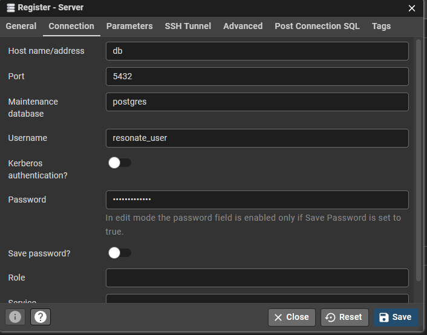

# Guide d'installation & de lancement — Resonate

> Réseau social musical — Projet SUPCONTENT · SUPINFO 2026  
> Équipe : Anthony · Krishna · Mélissa · Elisa

---

## Récupérer le projet

### Option 1 — Fichier ZIP

Le projet est livré sous forme de fichier ZIP. Il suffit de le décompresser :

```
Resonate.zip
└── Projet-Resonate/
    ├── backend/
    ├── frontend/
    ├── nginx/
    ├── docker-compose.yml
    ├── generate-certs.sh
    └── ...
```

Décompresser puis ouvrir un terminal dans le dossier `Projet-Resonate/`.

### Option 2 — GitHub

```bash
git clone https://github.com/AnthonySupinfo/Projet-Resonate.git
cd Projet-Resonate
```

---

## Prérequis

Avant de commencer, assurez-vous d'avoir installé :

| Outil              | Version minimum | Lien |
|--------------------|-----------------|--|
| **Docker Desktop** | 4.x             | https://www.docker.com/products/docker-desktop |
| **mkcert**         | 1.4+            | https://github.com/FiloSottile/mkcert#installation |
| **Git**            | 2.x             | https://git-scm.com |
| **Python**         | 3.1x            | https://www.python.org/downloads/ |


---

## Étape 1 — Créer les fichiers `.env`

Le projet nécessite **trois fichiers `.env`**. Ces fichiers contiennent des informations sensibles (mots de passe, clés API, secrets) et ne sont donc **pas committés dans le dépôt Git pour des raisons de sécurité**.

> 📄 **Dans le cadre du rendu de projet SUPINFO** les 3 documents .env sont fournis dans un dossier à part afin de faciliter l'installation à l'examinateur. Ces fichiers ne seraient en aucun cas transmis dans un cas concret.
> 
> Ils peuvent donc être directement copiés dans leur dossier correspondant (backend, frontend, ou le dossier général à la racine du dossier).
> 
> La suite des instructions concernant les fichiers .env est à suivre seulement dans le cas où vous ne copiez pas directement ces fichiers.

> Un fichier Word est également transmis avec toutes les clés, identifiants et mdp nécessaires.

### `backend/.env`

Créer le fichier `backend/.env` :

```bash
cp backend/.env.example backend/.env
```
Puis remplacer les clés nécessaires.

### `frontend/.env`

Créer le fichier `frontend/.env` :

```bash
cp frontend/.env.example frontend/.env
```
Puis remplacer les clés nécessaires.

### `/.env` (à la racine)

Créer le fichier `/.env` (dans le dossier général, bien se placer à la racine du dossier) :

```bash
cp ./.env.example ./.env
```
Puis remplacer les clés nécessaires.

---

## À propos de la clé API Last.fm

Last.fm est l'API qui fournit toutes les métadonnées musicales (albums, artistes, pochettes, pistes).

1. Aller sur https://www.last.fm/api/account/create
2. Se connecter ou créer un compte Last.fm
3. Remplir le formulaire (nom : `Resonate`, callback : `https://localhost`)
4. Récupérer la **API key** et le **Shared secret**

---

> 📄 **Si vous avez directement copié les fichiers .env**, vous pouvez remprendre les instructions ici.

## Étape 2 — Générer les certificats HTTPS

Le script `generate-certs.sh` automatise la création des certificats HTTPS locaux via **mkcert**.

**Ce que fait le script :**
1. Vérifie que `mkcert` est installé
2. Installe une autorité de certification locale dans votre navigateur — les certificats seront reconnus comme valides, sans avertissement de sécurité
3. Crée le dossier `nginx/certs/` si absent
4. Génère le certificat et la clé privée pour `localhost` et `127.0.0.1`

**Lancement :**
```bash
# macOS / Linux
bash generate-certs.sh

# Windows (Git Bash)
bash generate-certs.sh
```

Résultat attendu :
```
Generation des certificats HTTPS...
Termine ! Certificats crees dans nginx/certs/
Vous pouvez maintenant lancer : docker compose up --build
```

> ⚠️ Si mkcert demande un mot de passe système lors de l'installation, c'est normal — acceptez.

---

## Étape 3 — Lancer les tests (optionnel)

Pour vérifier que l'environnement Python est fonctionnel avant le lancement :

```bash
cd backend
pip install pytest pytest-asyncio --break-system-packages
python -m pytest tests/ -v
```

Résultat attendu : **20 tests passants**

```
tests/Test_anthony.py .....   [ 25%]
tests/Test_elisa.py   .....   [ 50%]
tests/Test_krishna.py .....   [ 75%]
tests/Test_melissa.py .....   [100%]
====== 20 passed ======
```

---

## Étape 4 — Lancer le projet

```bash
docker compose up --build -d
```

Le premier démarrage télécharge les images Docker et installe les dépendances — quelques minutes sont nécessaires.

**Arrêter le projet :**
```bash
docker compose down
```

**Rebuild complet (si modification de la BDD) :**

**Attention** : cette commande supprime toutes les données présentes dans la BDD.
```bash
docker compose down -v && docker compose up --build
```

---

## Accès aux services

Une fois le projet lancé :

| Service | URL | Description |
|---|---|---|
| 🎵 **Application** | https://localhost | Interface principale Resonate |
| 🔐 **Connexion** | https://localhost/login | Page de connexion |
| 📝 **Inscription** | https://localhost/register | Créer un compte |
| ⚙️ **API REST** | https://localhost/api/v1 | Backend FastAPI |
| 📖 **Documentation API** | https://localhost/docs | Swagger UI (mode développement) |
| 🗄️ **pgAdmin** | http://localhost:5050 | Interface d'administration BDD |

> Les identifiants pgAdmin se trouvent dans le **document Word fourni séparément**.

---

## Configuration pgAdmin

1. **Ouvrir pgAdmin** → http://localhost:5050
2. **Créer un nouveau serveur** Register → Servers
3. **Nommez-le "Resonate" et mettez les informations suivantes** :



4. **Enregistrez**, vous avez maintenant accès aux tables.

---

## Passer un utilisateur en administrateur

Pour accéder au panel de modération, il faut élever un compte au rôle `admin`.

**1. Ouvrir pgAdmin** → http://localhost:5050
**2. Se connecter** avec les identifiants du document Word  
**3. Naviguer vers :** Servers → Resonate → Databases → resonate → Schemas → public  
**4. Ouvrir le Query Tool** (icône SQL en haut) et exécuter :

```sql
UPDATE users SET role = 'admin' WHERE email = 'votre@email.com';
```

**5. Vérifier le résultat :**
```sql
SELECT id, email, username, role, is_active FROM users;
```

**6. Se reconnecter** à l'application — le bouton Admin apparaît dans la barre de navigation en haut à droite.

---

## Pour aller plus loin

Pour découvrir toutes les fonctionnalités de l'application, nous vous invitons à consulter les documents fournis avec le projet :

- **Manuel Utilisateur**
- **Documentation backend**
- **Documentation frontend**

---

*Resonate — Projet SUPCONTENT · SUPINFO · Juin 2026*
