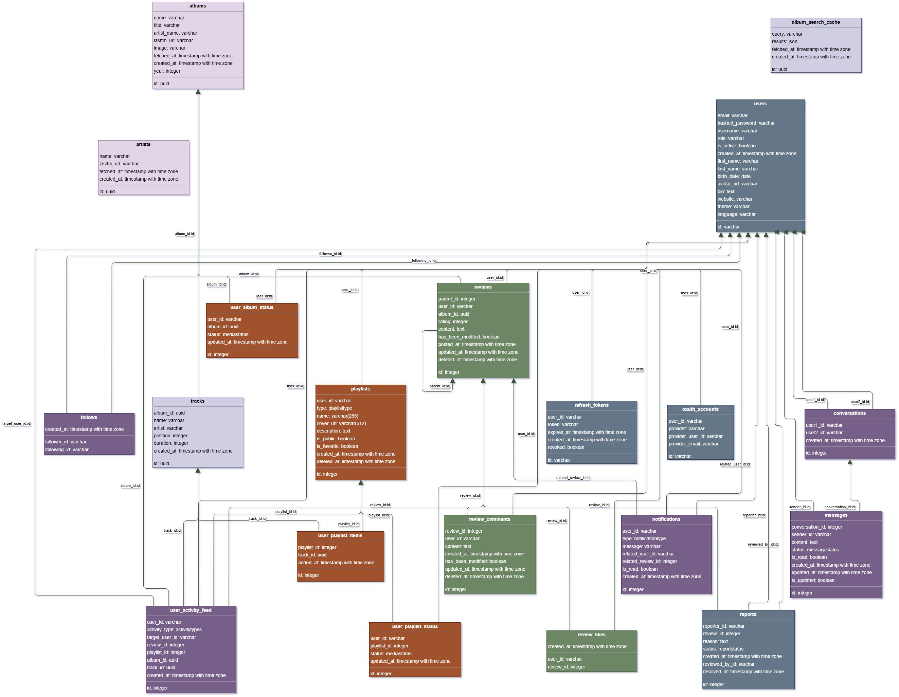

# Documentation Backend — Resonate

Stack : **FastAPI** (Python 3.12) · **PostgreSQL 16** · **SQLAlchemy 2.0 async** · **JWT** · **WebSocket**

---

## 1. Création utilisateur, Auth et Sécurité

### Inscription (`POST /auth/register`)
Lors de l'inscription, les informations saisies sont validées automatiquement par Pydantic : l'username doit contenir entre 3 et 20 caractères, le mot de passe doit contenir au moins 6 caractères dont 2 chiffres et 1 caractère spécial. 
Sécurisation des mots de passe grâce à Hash bcrypt. 
Création automatique d'une playlist "Musiques favorites" à l'inscription.

### Connexion (`POST /auth/login`)
Retourne un **access token JWT** (valide pendant 15 min), ainsi qu'un **refresh token opaque** (valide pendant 60 min) stocké en BDD (`refresh_tokens`). 
La rotation du refresh token révoque l'ancien à chaque usage, empêchant la réutilisation.

### OAuth2 — Google et GitHub (`GET /oauth/google|github/login`)
L'application prend en charge la connexion via Google et GitHub grâce au protocole OAuth2 (Flux Authorization Code standard). 
Si l'email utilisée est déjà associée à un compte existant → liaison automatique au compte OAuth. 
Sinon → un nouveau compte est créé sans mot de passe (`hashed_password = None`). 
Une fois l'authentification terminée, l'utilisateur est redirigé vers le frontend avec les tokens dans l'URL.

### Refresh et Logout
- **Renouvellement des sessions** (`POST /auth/refresh`) : Lorsqu'un access token expire, l'utilisateur en obtient un nouveau grâce au refresh token.Le refresh token est vérifié, puis révoqué, avant qu'un nouveau refresh token et access token ne soient générés. Cette rotation renforce la sécurité en limitant les risques liés à la réutilisation d'un ancien token.
- **Déconnexion** (`POST /auth/logout`) : Lors de la déconnexion, l'ensemble des refresh tokens encore actifs associés au compte utilisateur sont révoqués : cela invalide toutes les sessions ouvertes et empêche l'obtention de nouveaux access tokens sans une nouvelle authentification.

### Sécurité complémentaire
- **Protection contre les abus / Rate limiting** SlowAPI par IP : Un système de limitation des requêtes (rate limiting) est appliqué en fonction de l'adresse IP afin de limiter les tentatives malveillantes. Les inscriptions (register)  sont limitées à 3 requêtes par minutes, les connexions (login) à 5 requêtes par minutes, la vérification de disponibilité (check-availability) à 10 requêtes par minute et les demandes de réinitialisation de mot de passe à 3 requêtes par minute.
- **Réinitialisation / Reset mot de passe** : Lorsqu'un utilisateur demande la réinitialisation de son mot de passe, un lien contenant un JWT signé à usage unique (type `reset`, expiration 1h) lui est envoyé par email.
- **Validation des mots de passe** : Les règles de complexité sont appliquées aussi bien lors de l'inscription que lors de la réinitialisation, afin de garantir un niveau de sécurité cohérent.
- **Protection des fonctionnalités administrateur** : Toutes les routes réservées à l'administration sont sécurisées par une vérification spécifique des droits d'accès : dépendance `require_admin` injectée sur toutes les routes d'administration, afin d'empêcher les utilisateurs non autorisés d'y accéder.
- **Sécurisation de la documentation API (nginx)** : En environnement de production, l'accès aux routes `/docs` et `/openapi.json` sont bloquées via la configuration nginx.

### Admin — Modération
- **Consultation des signalements** (`GET /admin/reports`) : Les administrateurs peuvent consulter l'ensemble des signalements et les filtrer selon leur statut (PENDING / RESOLVED / DISMISSED / ALL). Chaque signalement est enrichis avec les informations nécessaires à son traitement, telles que @username du signaleur, artiste et nom de l'album ou user signalé.
- **Résolution d'un signalement** (`PATCH /admin/reports/{id}/resolve`) : Lorsqu'un signalement est jugé valide, la review concerné est désactivé par soft-delete et le signalement est marqué comme résolu.
- **Rejet d'un signalement** (`PATCH /admin/reports/{id}/dismiss`) : Si le contenu signalé ne nécessite aucune action, le signalement est rejeté tout en conservant le contenu visible sur la plateforme.
- **Mise en avant d'un avis** (`PATCH /admin/reviews/{id}/feature|unfeature`) : Les administrateurs peuvent sélectionner un avis comme "coup de coeur". Un seul avis peut être mis en avant par album, lorsqu'un nouvel avis est sélectionné, l'ancien est automatiquement retiré.
- **Consultation des avis mis en avant** (`GET /admin/featured`) : Cette route permet de lister toutes les reviews mises en avant actuellement sur la plateforme.
- **Gestion des utilisateurs** (`PATCH /users/{id}/ban et PATCH /users/{id}/unban`) : Les comptes utilisateurs peuvent être désactivés ou réactivés par les administrateurs via le champ`is_active`, permettant de suspendre temporairement l'accès sans supprimer les données associées.

---

## 2. Gestion du user connecté, modification de compte et stats

### Profil utilisateur (`GET /users/me et PATCH /users/me`)
- **Consultation du profil** : L'utilisateur peut accéder à l'ensemble des informations de son profil via la route dédiée (`GET /users/me`).
- **Modification du profil** : Les informations du comptes peuvent être mises à jour partiellement grâce à une requête (`PATCH /users/me`). Les champs pris en charge incluent notament l'avatar, la biographie, le site web, le thème d'affichage, la langue et les préférences de notifications par email → seuls les chmpas transmis dans la requête sont modifiés, les autres restent inchangés.

### Modification sécurisée des informations de connexion 
- **Changement sécurisé de mot de passe** (`POST /auth/change-password`) : Pour modifier son mot de passe, l'utilisateur doit obligatoirement fournir son mot de passe actuel. Cette vérification permet de s'assurer que la demande est bien effectuée par le propriétaire du compte. 
- **Changement sécurisé d'email** (`POST /auth/change-email`) : Le changement d'adresse email suit le même principe de sécurite et nécessite également la saisie du mot de passe actuel.
- **Gestion des comptes OAuth** : Les comptes créés exclusivement via Google ou GitHub ne possèdent pas de mot de passe local ainsi les routes de modification du mot de passe ou de l'email sont explicitement bloquées pour ces utilisateurs. 

### Suppression de compte (`DELETE /users/me`)
- **Suppression définitive des données** : lorsqu'un utilisateur demande la suppression de son compte, celui-ci est définitivement retiré de la base de données.
- **Nettoyage automatique des données associées** : Grâce aux contraintes de suppression en cascade (CASCADE), l'ensemble des données liées au compte est également supprimé automatiquement. Cela inclut notamment les reviews, commentaires, playlists, abonnements, notifications et autres données dépendantes.
- **Révocation des sessions** : Toutes les sessions actives sont invalidées afin d'empêcher tout accès ultérieur au compte supprimé.

### Export des données personnelles (`GET /users/me/export`)
- **Export RGPD** : Les utilisateurs peuvent récupérer l'ensemble de leurs données personnelles au format JSON ou CSV (`?format=csv`).
- **Contenu de l'export** : L'export comprend 6 catégories de données : informations de profil, bibliothèque musicale, playlists, reviews, commentaires et statuts des albums. 
- **Transmission optimisée** : Les données sont envoyées sous forme de flux via `StreamingResponse`.

### Statistiques utilisateur (`GET /users/{id}/stats`)
- **Données agrégées** : Cette route fournit différentes statistiques calculées directement en base de données à l'aide de fonctions d'agrégation (`func.count()`). Les informations retournées comprennent notamment : le nombre d'abonnés (followers), le nombre d'abonnements (following), le nombre de playlists, le nombre d'albums terminés, le nombre d'albums en cours d'écoute (LISTENING), le nombre de reviews publiées et enfin le nombre de commentaires publiés.

### Profil public (`GET /users/{id}`)
- **Consultation d'un autre utilisateur** : Cette route permet d'afficher le profil public d'un utilisateur ainsi que ses statistiques principales et ses playlists publiques.
- **Relation avec l'utilisateur connecté** : La réponse inclut également l'information `is_followed_by_me`, permettant de savoir si l'utilisateur connecté suit déjà ce profil. 

### Signalement d'un utilisateur (`POST /users/{id}/report`)
- **Signalement d'un compte** : Les utilisateur peuvent signaler un autre membre directement depuis son profil. Un objet `Report` est alors créé avec un champ `reported_user_id`, distinct du système de signalement des reviews. 
- **Prévention des doublons** : Une contrainte d'unicité empêche un même utilisateur de signaler plusieurs fois la même personne, garantissant un traitement plus fiable des signalements.

---

## 3. Données Last.fm, mise en cache, et gestions des tracks et albums

### Intégration de l'API Last.fm :
- **Service centralisé** : Tous les échanges avec l'API Last.fm sont regroupés dans un service dédié `LastFMService` afin de centraliser la logique métier et de simplifier la maintenance. 
- **Gestion des erreurs et performances** : Les appels sont protégés par un délai maximal de 5 secondes (timeout) et gèrent les principaux cas d'erreur tels que les limitations de quota (429), les ressources introuvables (404) ou encore les erreurs spécifiques retournées par Last.fm.

### Mise en cache des albums et artistes (`album_search_cache` + table `albums`)
- **Recherche des albums** : Les résultats de recherche sont enregistrés dans la table `album_search_cache` pendant une durée de 7 jours. Ainsi, si une recherche identique est déjà présente et encore valide, les données sont directement récupérées depuis la base de données sans effectuer de nouvel appel à l'API Lastfm.
- **Fiches détaillées des albums** : Lorsqu'un album est consulté, ses informations sont stockées dans la table `albums` : titre, artiste, image, tags, années de sortie et URL lastfm. Cetet stratégie permet d'améliorer les performances tout en limitant le nombre de requêtes vers l'API externe.
- **Synchronisation des pistes** : À chaque actualisation des données d'un album, les pistes associées sont récréées afin de garantir la cohérence avec les informations fournies par Last.fm.
- **Cache des artistes** : Les informations relatives aux artistes sont également stockées localement dans une table dédiée (`artists`) afin de réduire les appels répétés à l'API externe.

### Proxy d'image (`GET /image-proxy`)
- **Contournement des limitations navigateur** : Les images fournies par Last.fm transitent par le backend avant d'être envoyées au client. Cette approche permet d'éviter les problèmes liés aux politiques CORS ainsi qu'aux contenus mixtes HTTP/HTTPS.
- **Image de secours** : En cas d'échec du chargement d'une image distante, une image par défaut (`fallback.svg`) est automatiquement renvoyée afin de préserver l'expérience utilisateur. 

### Gestion des status d'albums (`PUT /albums/{id}/status`)
- **Organisation de la bibliothèque personnelle** : Les utilisateurs peuvent attribuer un statut à chaque album parmi les valeurs suivantes (Enum `MediaStatus` ) : à écouter (PLANNED), en cours d'écoute (LISTENING), terminé (COMPLETED) ou encore abandonné (DROPPED).
- **Création ou mise à jour automatique** : L'opération utilise un mécanisme d'upsert permettant soit de créer un nouveau statut, soit de mettre à jour un statut existant.
- **Intégration au fil d'actualité** : Chaque changement de statut génère automatiquement une activité visible dans le fil social des utilisateurs abonnés.

### Découverte musicale aléatoire (`GET /albums/random/track`)
- **Sélection aléatoire d'une piste** : Cette route récupère une piste aléatoire depuis la base de données via `func.random()`afin d'alimenter l'animation et la découverte musicale sur la page d'accueil.s
- **Gestion des cas limites** : Si aucune donnée n'est encore présente dans la BDD, un album de secours est utilisé afin de garantir le bon fonctionnement de l'interface.

### Filtrage des résultats de recherche (`GET /search/albums`)
- **Paramètres de filtrage disponibles** : La route de recherche accepte des filtres optionnels par année (`year_min`, `year_max`) et par genre (`genre`), ainsi qu'un paramètre de tri (`sort`) supportant les valeurs az, za, popularity, date.
- **Enrichissement depuis le cache local** : L'API Last.fm ne retournant pas les métadonnées complètes (genre, année) dans ses résultats de recherche, le backend croise automatiquement les résultats avec les données présentes dans la table `albums`. Ces informations n'étant disponibles que via un appel `album.getinfo`, elles sont progressivement enrichies au fur et à mesure des consultations des fiches albums par les utilisateurs.
- **Limitation connue** : Les filtres par genre et par année sont opérationels uniquement sur les albums déjà présents dans le cache local. Un album jamais consulté sur la plateforme ne dispose pas encore de ces métadonnées et sera exclu des résultats filtrés. Ce comportement est intentionnel et constitue un compromis délibéré face aux contraintes de l'API last.fm.

---

## 4. Bibliothèque personnelle et Playlists

### Gestion des playlists (`/playlists/`)
- **Deux types de playlists** : L'application distingue deux catégories de playlists : 
    - **DEFAULT** : playlist système créée automatiquement lors de l'inscription (Musiques favorites).
    - **CUSTOM** : playlists personnalisées créées librement par les utilisateurs.
- **Gestion complète des playlists** : Les utilisateurs peuvent créer, consulter, modifier et supprimer leurs playlists. La suppression repose sur un mécanisme de soft delete, permettant de conserver l'historique en base de données tout en masquant la playlist dans l'application. 
- **Paramètres de visibilité** : Chaque playlist peut être définie comme publique ou privée afin de contrôler son accessibilité aux autres utilisateurs.
- **Playlist favorite** : Le champ`is_favorite` permet à l'utilisateur de mettre en avant et épingler une playlist particulière sur son profil.

### Bibliothèque personnelle (`GET /users/me/library`)
- **Consultation de la collection musicale** : Cette route permet de récupérer l'ensemble des playlists de l'utilisateur ainsi que les albums enregistrés dans sa bibliothèque, accompagnés de leur statut de suivi (à écouter, en cours, terminé ou abandonné)
- **Enrichissement automatique des données** : Les informations locales sont associées aux données des albums stockées en cache (Jointure `UserAlbumStatus ↔ Album`). Lorsqu'une image est manquante, celle-ci est automatiquement récupérée depuis Last.fm afin de garantir un affichage complet. 

### Ajout de tracks/morceaux à une playlist (`POST /playlists/{id}/tracks`)
- **Gestion intelligente des pistes** : Lors de l'ajout d'un morceau, le système vérifie d'abord si celui-ci existe déjà dans la base de données.
- **Création automatique si nécessaire** : Si la piste n'existe pas encore, une nouvelle entrée est créée et associée à l'album correspondant dejà présent dans la base. 
- **Prévention des doublons** : Une contrainte d'unicité empêche l'ajout multiple d'un morceau dans une même playlist.
- **Intégration au fil d'actualité** : Lorsque la playlist est publique, l'ajout d'un morceau génère automatiquement une activité visible dans le fil d'actualité des abonnés. 

### Consultation des playlists publiques d'un user (`GET /playlists/user/{id}`)
- **Accès aux playlists partagées** : Les visiteurs peuvent consulter les playlists publiques d'un utilisateur sans avoir besoin d'être authentifiés. 
- **Respect de la confidentialité** : Seules les playlists marquées comme publiques (`Is_public = true`) sont retournées par cette route. Les playlists privées restent visibles uniquement par leur propriétaire.

---

## 5. Reviews et interactions communautaires 

### Création d'une review (`POST /albums/{id}/reviews`)
- **Une review par album et par utilisateur** : Afin de garantir la cohérence des avis, un utilisateur ne peut posséder qu'une seule review active pour un même album. Cette règle est appliquée directement au niveau de la base de donénes grâce à une contrainte d'unicité.
- **Restauration des reviews supprimées** : Si une review précédemment supprimée existe déjà pour cet album, celle-ci est réactivée et mise à jour au lieu de créer une nouvelle entrée.
- **Intégration au fil d'actualité** : La publication d'une review génère automatiquement une activité visible dans le fil d'actualité des utilisateurs abonnés (feed).

### Modification et Suppression des reviews
- **Modification d'une review** (`PATCH /reviews/{id}`) : Les auteurs peuvent modifier leur avis à tout moment. La mise à jour est partielle et seuls les champs transmis sont modifiés. Un indicateur spécifique permet de signaler qu'une review a été éditée après sa publication. 
- **Suppression d'une review** (`DELETE /reviews/{id}`) : La suppression repose sur un mécanisme de soft delete. La review est masquée de l'application mais reste conservée en base de données à des fins de modération et de traçabilité.
- **Contrôle des droits** : Chaque opération de modification ou de suppression vérifie systématiquement que l'utilisateur est bien le propriétaire de la review concernée.

### Consultation des reviews (`GET /albums/{id}/reviews`)
- **Affichage des avis communautaires** : Cette route permet de récupérer l'ensemble des reviews associées à un album ainsi que les informations publiques de leurs auteurs (Jointure Review + User). 
- **Mise en avant des coups de coeur** : Les reviews sélectionnées par les administrateurs comme "coups de coeur" apparaissent en priorité, suivies des autres avis classés du plus récent au plus ancien (`is_featured DESC, posted_at DESC`). 
- **Données enrichies** : Chaque review est accompagnée de plusieurs informations complémentaires : nombre de mentions "j'aime" (`likes_count`), état du like pour l'utilisateur connecté (`user_liked`), les commentaires associés (`comments`), les réponses éventuelles (`replies`), ainsi que les informations de l'auteur. 

### Interactions communautaires 
- **Mentions "J'aime" (Like/Unlike)** : `POST /reviews/{id}/like et DELETE /reviews/{id}/like` : 
    - **Appréciation d'une review** : Les utilisateurs peuvent aimer ou retirer leur appréciation d'une review. 
    - **Prévention des doublons** : Une contrainte d'unicité garantit qu'un utilisateur ne peut attribuer qu'un seul "j'aime" à une même review.
    - **Notifications automatiques** : Lorsqu'une review reçoit un like, son auteur reçoit une notification. Si les notifications par email sont activées dans ses préférences, un email est également envoyé.

- **Commentaire** : `POST /reviews/{id}/comment` 
    - **Discussion autour des reviews** : Chaque review dispose d'un espace de commentaires permettant aux membres d'échanger autour de l'avis publié.
    - **Notification de l'auteur** : Lorsqu'un commentaire est ajouté, l'auteur de la review est automatiquement averti via une notification interne, et si activé, par email.

- **Signalement** : `POST /reviews/{id}/report` 
    - **Signalement de contenu inapproprié** : Les utilisateurs peuvent signaler une review ne respectant pas les règles de la plateforme afin qu'elle soit examinée par l'équipe de modération.  
    - **Limitation des signalements multiples** : Un même utilisateur ne peut signaler qu'une fois une review donnée, ce qui évite les abus et les doublons dans le processus de modération.  

---

## 6. Fonctionnalités sociales : Feed, Notifications et Messagerie

### Feed social / Fil d'actualité (`GET /users/me/feed`)
- **Suivi des activités des abonnements** : Le fil d'actualité regroupe les actions réalisées par les utilisateurs suivis afin de favoriser la découverte et les interactions au sein de la communauté. 
- **Type d'activités pris en charge** : Sept types d'évènements peuvent apparaître dans le fil d'actualité : le suivi d'un utilisateur (`FOLLOW_USER`), la création d'une playlist (`CREATE_PLAYLIST`), l'ajout d'un morceau à une playlist (`ADD_TRACK_PLAYLIST`), le changement de statut d'un album (`UPDATE_ALBUM_STATUS`), la publication d'une review (`REVIEW_ALBUM`), le like d'une review (`LIKE_REVIEW`) et enfin le commentaire sur une review (`COMMENT_REVIEW`).
- **Enrichissement dynamique des données** : Chaque activité est automatiquement enrichie avec les informations nécessaires à son affichage : utilisateur concerné, album, playlist, review, nombre de likes ou encore commentaires associés. 

### Interactions sur le fil d'actualité 
- **Commentaires sur une activité** (`POST /users/feed/{id}/comments`) : Les utilisateurs peuvent réagir directement aux publications du fil d'actualité en ajoutant des commentaires.
- **Likes sur une activité** (`POST /users/feed/{id}/like et DELETE /users/feed/{id}/like`) : Chaque activité peut également recevoir des mentions "j'aime" afin d'encourager les interactions entre membres.
- **Système indépendant des reviews** : Les likes et commentaires du fil d'actualité sont gérés séparément de ceux associés aux reviews afin de distinguer les différents types d'interactions.

### Follows et gestion des abonnements (`POST /users/{id}/follow et DELETE /users/{id}/follow`)
- **Suivre un utilisateur** : Les membres peuvent s'abonner à d'autres profils afin de suivre leurs activités et enrichir leur fil d'actualité.
- **Prévention des actions incohérentes** : Une vérification empêche un utilisateur de se suivre lui-même.
- **Intégration aux fonctionnalités sociales** : Chaque nouvel abonnement génère automatiquement : 
    - Une activité dans le fil d'actualité (feed)
    - Une notification pour l'utilisateur concerné
    - Un email de notification si cette option est activée

### Système de notifications
- **Stockage en base de données** : Toutes les notifications sont enregistrées dans une table dédiée (`notifications`) afin de garantir leur persistance.
- **Types de notifications** : Le système prend actuellement en charge : les nouveau follower (`FOLLOW`), les likes sur une review (`LIKE`) ainsi que les commentaires sur une review (`COMMENT`).
- **Mise à jour en temps réel** : Lorsqu'une notification est créée, elle est immédiatement transmise à l'utilisateur concerné via WebSocket sans nécessiter de rechargement de la page.
- **Gestion de la lecture** : Les notifications peuvent être marquées comme lues individuellement ou en une seule opération globale.
- **Compteur de notifications non lues** : Un compteur permet d'afficher en permanence le nombre de notifications en attente de consultation.

### Messagerie instantanée en temps réel
- **Communication via WebSocket** (`/ws`) : La messagerie repose sur une connexion WebSocket dédiée permettant des échanges instantanés entre utilisateurs. 
- **Authentification sécurisée** : Lors de l'ouverture de la connexion, l'utilisateur s'authentifie en transmettant son jeton JWT. Une fois validé, la connexion est associée à son identifiant utilisateur. 
- **Gestion centralisée des connexions** : Un gestionnaire de connexions (`ConnectionManager`) maintient la liste des utilisateurs actuellement connectés afin de permettre l'envoi de messages en temps réel.

### Conversations privées
- **Accès limité aux abonnements mutuels** : Une conversation ne peut être créée qu'entre deux utilisateurs qui se suivent mutuellement, garantissant ainsi un système de messagerie volontaire et non intrusif.
- **Prévention des doublons** : Une contrainte spécifique (`user1_id <= user2_id`) assure qu'une seule conversation puisse exister entre deux utilisateurs, quel que soit l'ordre dans lequel ils sont enregistrés.

### Gestion des messages
- **Envoi de messages** : Les utilisateurs peuvent échanger des messages instantanément au sein d'une conversation.
- **Modification des messages** : Les messages envoyés peuvent être modifiés par leur auteur après publication.
- **Suivi de lecture** : Chaque message peut être marqué comme lu afin d'améliorer le suivi des conversations. 
- **Notifications en temps réel** : Toute nouvelle action (message, modification ou lecture) est immédiatement transmise au destinataire via WebSocket. 

### Notification par email (`services/email.py`)
- **Emails transactionnels** : En complément des notifications internes, certains événements peuvent déclencher l'envoi d'un email : un nouveau follower, un like sur une review ou encore un commentaire sur une review. 
- **Templates HTML dédiés** : Chaque type de notification dispose de son propre modèle HTML (3 templates) afin d'offrir une présentation claire et cohérente.
- **Envoi asynchrone et tolérant aux erreurs** : Les emails sont envoyés de manière non bloquante. En cas d'erreur SMTP ou de problème réseau, l'action principale de l'utilisateur reste exécutée normalement afin de préserver l'expérience utilisateur (Toujours wrappé dans `try/except` silencieux).

### Diagramme de la base de données Resonate
Accessible en plus grand dans le dossier `./docs/images/`.

